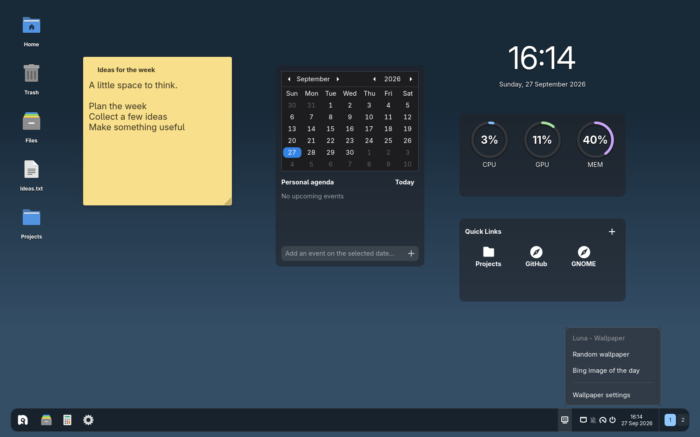
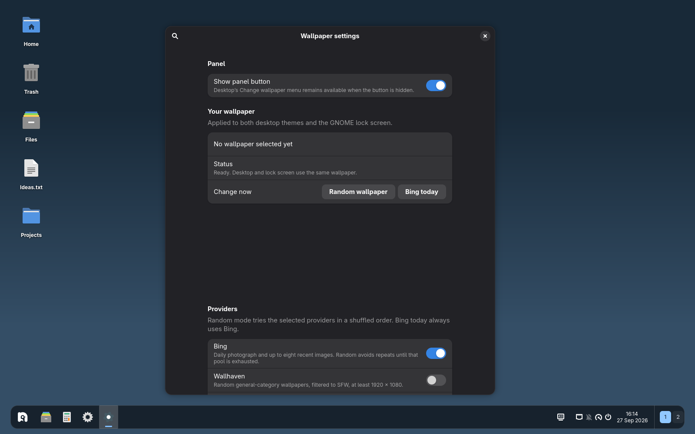

# Luna Wallpaper

**A fresh view, whenever you feel like it.**

Daily photographs, random discoveries, and automatic wallpaper rotation for GNOME Shell 50.



*Captured in an isolated test session. The desktop widgets and taskbar are the separate Luna Desktop and Luna Taskbar extensions; Wallpaper works without them.*

## Find your next background

- **Today’s photograph.** Apply Bing’s image of the day in a click.
- **Something unexpected.** Discover random images from Bing’s recent archive or Wallhaven’s general SFW collection.
- **Follow your interests.** Choose categories and add keywords for random selections.
- **Set your own pace.** Change manually or rotate hourly, every six or twelve hours, daily, or weekly.
- **Keep both themes in sync.** Images apply to GNOME’s light and dark desktop variants. GNOME’s lock screen uses its usual blurred desktop background.
- **Stay in control.** Rotation starts in manual mode. Enabling the extension does not immediately replace your wallpaper.

Use the panel button to pick an image or open settings. Prefer a cleaner panel? Hide the button; with [Luna Desktop](https://github.com/Wuild/luna-desktop), **Change wallpaper** remains in the desktop’s context menu.



## A few useful details

Bing offers a recent image archive, not a category-search API. Category matching uses its captions, so narrow filters may return no images. Wallhaven provides a larger pool and supports search terms. **Bing image of the day** always requests today’s image, independently of random-mode filters.

Rotation intervals count from the last successful change. Missed rotations run once when your session becomes active again. Failed downloads leave the existing background alone. Images retain their original copyright; **View source** opens the provider’s attribution page.

Downloads require network access and run outside GNOME Shell. No provider credentials are needed. [More about providers, stored images, and rotation](docs/providers-and-gdm.md).

## Install

Requires **GNOME Shell 50**, GTK 4/libadwaita, and Python 3 with PyGObject and GdkPixbuf 2.0. Build tools: Node.js, pnpm, and GLib schema tools.

```sh
git clone https://github.com/Wuild/luna-wallpaper.git
cd luna-wallpaper
pnpm run pack
gnome-extensions install --force luna-wallpaper@wuild.shell-extension.zip
```

There are no npm dependencies. Log out and back in, then enable **Luna - Wallpaper** in GNOME’s Extensions app, or run:

```sh
gnome-extensions enable luna-wallpaper@wuild
```

Log out and back in after installing updates. Disabling or uninstalling keeps your current wallpaper. Downloaded images stay under `~/.local/share/luna-wallpaper/` (or your `XDG_DATA_HOME`).

## Optional login-screen background

An experimental **GDM** helper can apply the current image to supported system themes. This is a system-level change, requires administrator authentication, and is separate from desktop rotation. It is never run by the rotation timer.

Read the [GDM compatibility and restore guide](docs/providers-and-gdm.md#gdm-login-screen) before using it. Devkit does not isolate GDM changes from your real system.

## More Luna

Combine Wallpaper with [Luna Desktop](https://github.com/Wuild/luna-desktop) for icons and widgets, [Luna Taskbar](https://github.com/Wuild/luna-taskbar) for apps and panels, or try them together in [Luna Devkit](https://github.com/Wuild/luna-devkit).

Also from the same author: [Mutter Unmuted](https://github.com/Wuild/mutter-unmuted), an experimental, opt-in Mutter/Xwayland patch pair for legacy X11 push-to-talk across GNOME on Wayland. It is a separate project with its own system requirements and input-forwarding implications.

## Development and feedback

```sh
pnpm build
pnpm test
```

Tests use temporary files and never alter the system GDM resource. [Report a bug or suggest a feature](https://github.com/Wuild/luna-wallpaper/issues), including your distribution, GNOME version, provider, and any error shown in settings.

## License

Copyright © 2026 Wuild. Licensed under [GPL-2.0-or-later](LICENSE). You are welcome to use, study, modify, and redistribute it under those terms.
